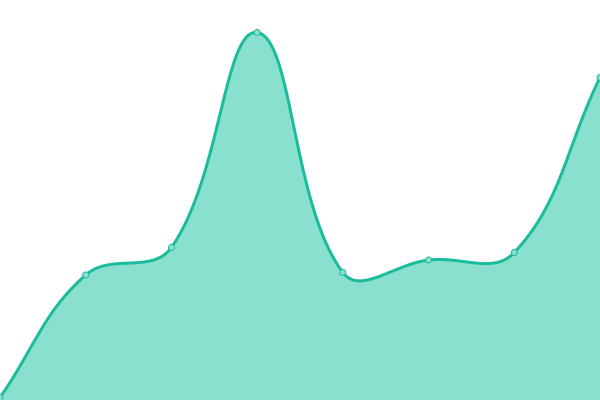

# [📈 Live Status](https://d0iq.github.io/upptime): <!--live status--> **🟧 Partial outage**

We use [Issues](https://github.com/d0iq/upptime/issues) as incident reports, [Actions](https://github.com/d0iq/upptime/actions) as uptime monitors, and [Pages](https://d0iq.github.io/upptime) for the status page.

<!--start: status pages-->
<!-- This summary is generated by Upptime (https://github.com/upptime/upptime) -->
<!-- Do not edit this manually, your changes will be overwritten -->
<!-- prettier-ignore -->
| URL | Status | History | Response Time | Uptime |
| --- | ------ | ------- | ------------- | ------ |
|  [Liys](https://www.liys.site) | 🟥 Down | [liys.yml](https://github.com/d0iq/upptime/commits/HEAD/history/liys.yml) | 

 0ms
     
 | 

<a href="https://d0iq.github.io/upptime/history/liys">0.00%</a>
    

|  [Google](https://www.google.com) | 🟩 Up | [google.yml](https://github.com/d0iq/upptime/commits/HEAD/history/google.yml) | 

 92ms
     
 | 

<a href="https://d0iq.github.io/upptime/history/google">100.00%</a>
    

<!--end: status pages-->

[**Visit our status website →**](https://d0iq.github.io/upptime)
